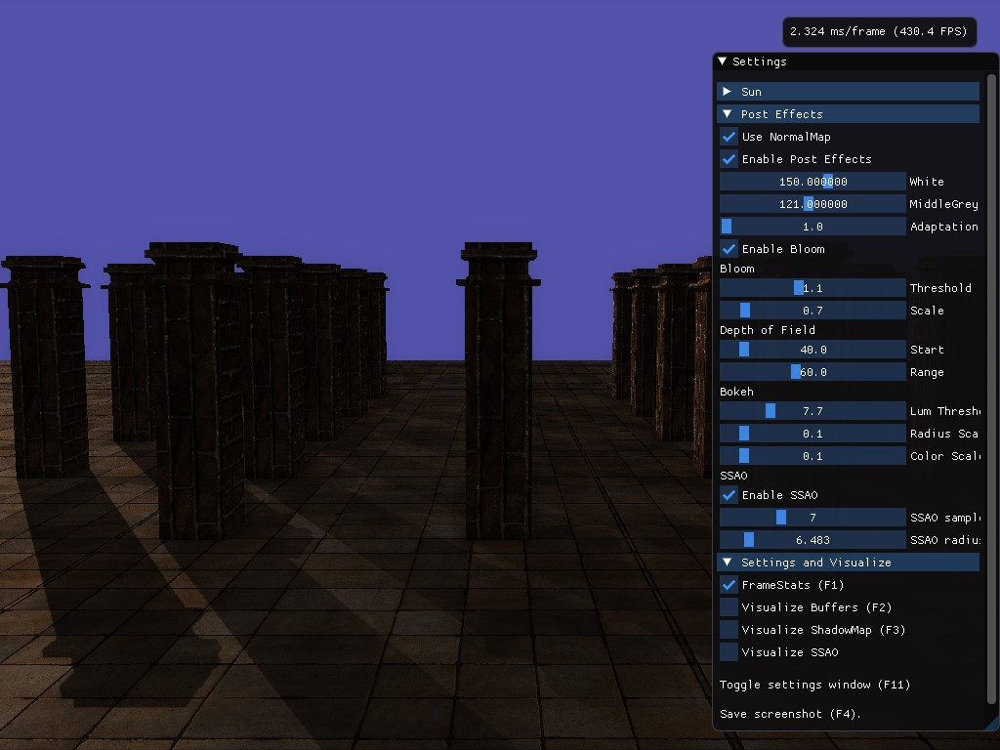

# EffectsRendering

WIP screenshot
## Controls:

Keys:
- F1 Framestats
- F2 Visualize GBuffer
- F3 Visualize ShadowMap
- F4 Save screenshot
- F11 Toggle settings window
- ESC Quit

Mouse:
- MMB Rotate directional light
- RMB Rotate camera look 

## Features:
- HDR 
- bloom 
- bokeh
- dof
- ssr
- ssao
- sun rays
