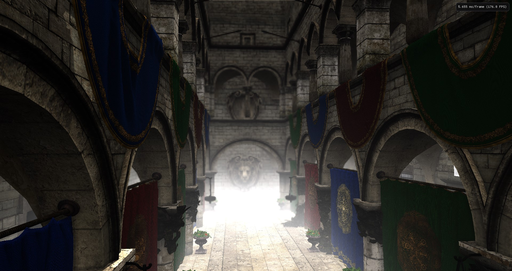
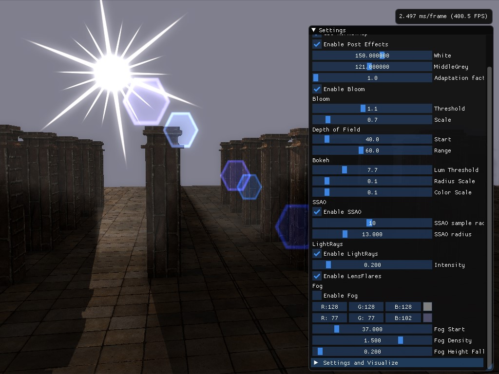

# EffectsRendering

Sponza scene with bloom effect.

This project showcases various post-processing effects and rendering techniques implemented in DirectX 11 and HLSL.

🎥 Video Showcase
Check out the YouTube video demonstrating effects like bloom, light rays, and lens flare, along with a debug render view of deferred shading buffers:
[▶ Watch on YouTube](https://youtu.be/tpAFA-Ydh0k)

Scene featuring lens flare, sun rays, fog, and more.

## Features:
This renderer includes a variety of post-processing effects:

- HDR Rendering
- Bloom
- Bokeh Depth of Field (DoF)
- Screen-Space Ambient Occlusion (SSAO)
- Distance & Height-Based Fog
- Sun Rays (God Rays)
- Lens Flare

## Controls:

Keys:
- F1 Framestats
- F2 Visualize GBuffer
- F3 Visualize ShadowMap
- F4 Save screenshot
- F11 Toggle settings window
- ESC Quit

Mouse:
- MMB Rotate directional light
- RMB Rotate camera look 

Below is a screenshot showing the PostFX settings in ImGui:

